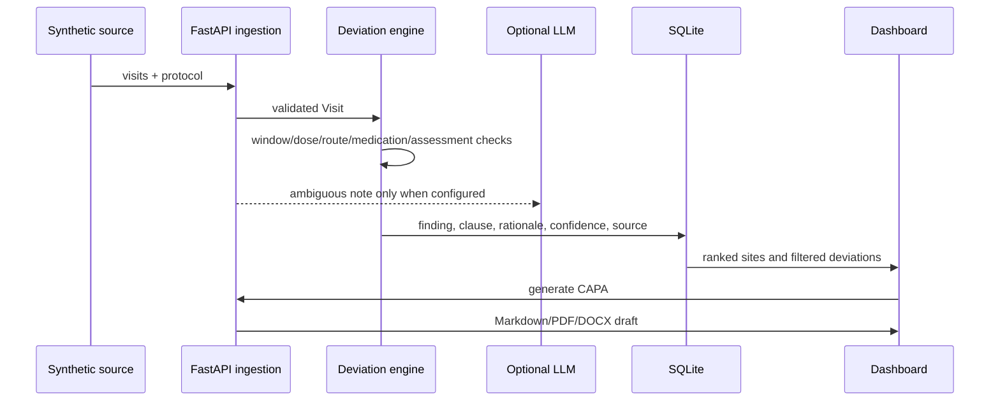

# Architecture and controls

## Data flow

## Exact risk formula

Every component is clipped to 0–1. The score is:

`100 × (0.25F + 0.25S + 0.15T + 0.12M + 0.10E + 0.08R + 0.05Q)`

| Signal | Definition | Weight |
|---|---|---:|
| F | Deviation frequency / 0.50 | 25% |
| S | Severity-weighted deviations per visit / 1.20; Major=3, Minor=1.5, Administrative=0.5 | 25% |
| T | Positive month-over-month deviation growth | 15% |
| M | Days since monitoring / 120 | 12% |
| E | Enrollment progress × deviation rate / 0.35 | 10% |
| R | Largest repeated deviation type / all site deviations | 8% |
| Q | Mean query resolution days / 30 | 5% |

Bands: Low 0–29.9, Medium 30–54.9, High 55–74.9, Critical 75–100. The weights are transparent demo assumptions and require sponsor-specific validation and calibration before operational use.

## Severity rules and ICH E6(R2) mapping

| Classification | Demo rule | Relevant E6(R2) control |
|---|---|---|
| Major | Missed required visit, dose outside tolerance, wrong administration route, banned medication, or narrative safety signal | §4.5.1 conduct per protocol; §4.5.2 agreement and documented changes; §4.5.3 document/explain deviations; §5.20.1 prompt action for noncompliance |
| Minor | Out-of-window completed visit or missing assessment without evidence of immediate safety/primary-integrity impact | §4.5.3 documentation; §4.9 complete and accurate records; §5.18 monitoring |
| Administrative | Unknown label or documentation/process problem without identified safety or integrity impact | §4.9 records and §8 essential documents |

This mapping is decision-support guidance, not a claim that ICH defines these exact three labels. The impact assessment and final classification belong to the sponsor's controlled procedure and qualified reviewers. E6(R2) §5.20.2 supports root-cause analysis and corrective/preventive action when serious or persistent noncompliance is identified.

## Security and AI boundaries

- The shipped dataset is synthetic. Real clinical data must not be loaded into this demo.
- The API key is server-side and never exposed to the browser.
- With no key, the LLM adapter is disabled and deterministic operation continues.
- AI findings are confidence-gated at 0.70, source-labeled, and require human sign-off.
- Authentication, authorization, audit trails, electronic signatures, validation evidence, retention, and disaster recovery are intentionally outside the hackathon scope.

