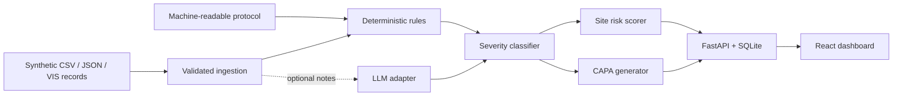

# Solution overview

Trial Sentinel is a local-first monitoring application. A reproducible generator creates 200 fictional sites, 1,000 fictional participants, and 5,000 fictional visits. FastAPI loads those records into SQLite; a deterministic engine checks visit windows, dosing, route, prohibited concomitant medication, and assessment completion. Free-text notes may optionally be sent to a configured LLM through a provider-neutral interface. The React dashboard ranks site risk, filters deviations, displays monthly trends, and exports draft CAPA reports.

Deterministic results remain available without network access or an API key. LLM output is confidence-gated and labeled by source, and all CAPA narratives require human approval.

